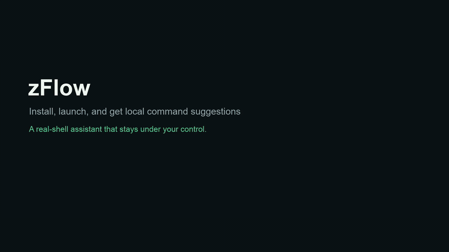

# zFlow

zFlow is a local-first terminal assistant for your real shell. It runs inside a TUI, learns from your local bash/zsh history, and suggests the next command without taking control away from you.

> This repository is the public release surface for zFlow. It contains product-facing documentation, website assets, and release materials. It should not contain the source code of the private development project.

[www.zflow.dev](https://www.zflow.dev/)

The static website uses Vercel Web Analytics for aggregate page-view metrics.

## Demo Video

The short promotional demo shows installation, startup, command recommendations, candidate selection, execution, layout mode switching, and local-first learning.



## Why zFlow

- **Real shell, not a replacement shell**: keep using bash or zsh with your existing habits, shell history, directory changes, and interactive programs.
- **Local-first suggestions**: zFlow learns from your command history and recent actions on your machine.
- **Preview before action**: suggestions are shown in a TUI candidate area; selecting a command fills the input first by default.
- **Retrieval-assisted recall**: local retrieval can surface relevant historical commands, including commands used in other directories.
- **Measurable recommendation quality**: `zflow eval` compares recommendation strategies on your local history.
- **Private by default**: command history and recommendation indexes stay under `~/.config/zflow/` by default.

## Installation

zFlow is distributed through npm. The current npm packages support macOS Apple Silicon and Intel Mac.

```bash
npm install -g zflow-cli
zflow --version
```

You can also run it without a global install:

```bash
npx zflow-cli --version
npx zflow-cli
```

The main `zflow-cli` package supports macOS Apple Silicon and Intel Mac.

## Quick Start

```bash
# Import shell history and rebuild the local recommendation index
zflow learn

# Evaluate recommendation quality on local history
zflow eval

# Start the interactive terminal assistant
zflow
```

`zflow learn` imports available bash/zsh history into zFlow's local database and rebuilds the retrieval index.

`zflow eval` compares local recommendation strategies, including history-only, retrieval-assisted, and feedback-assisted recommendation quality.

## Common Commands

```bash
zflow learn       # Sync shell history and rebuild the index
zflow eval        # Evaluate local recommendation quality
zflow             # Start the interactive terminal assistant
zflow clean       # Remove zFlow learning data
zflow --version   # Print version
```

For non-interactive cleanup:

```bash
zflow clean --yes
```

`clean` removes zFlow's own learning database, internal history, and sync ledger. It does not delete original bash/zsh history, shell configuration, or logs.

## Configuration

The configuration file is stored at:

```text
~/.config/zflow/zflow.json
```

Example:

```json
{
  "retrieval": { "enabled": true },
  "adaptive_feedback": { "enabled": false },
  "execute_selected_candidate_on_enter": false
}
```

By default, the selected suggestion is inserted into the input area first. Press Enter again to execute it. Set `execute_selected_candidate_on_enter` to `true` if you want a selected suggestion to execute on the first Enter.

## Data and Privacy

zFlow stores learning data locally under:

```text
~/.config/zflow/
```

It reads local shell history to generate suggestions. If a history file is larger than 64 MiB, zFlow reads only the most recent 64 MiB. Command history and recommendation indexes are not uploaded by default.

## Version

Latest documented release version: `1.0.2`.

Check the current npm version:

```bash
npm view zflow-cli version
```
